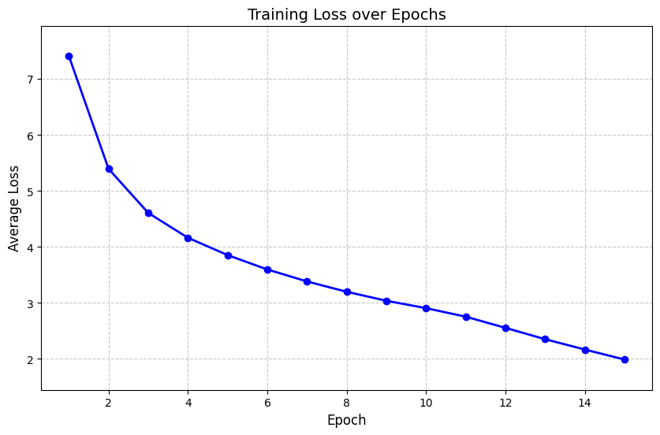

# English to Urdu Transformer

This project implements a Transformer model to translate text from English to Urdu using the [UMC005-Corpus dataset](https://ufal.mff.cuni.cz/umc/005-en-ur/). The model is built using TensorFlow and Keras, and it leverages the power of multi-head attention and positional encoding to perform sequence-to-sequence translation tasks.

## Table of Contents

- [Installation](#installation)
- [Dataset](#dataset)
- [Model Architecture](#model-architecture)
- [Training](#training)
- [Evaluation](#evaluation)
- [Example Translations](#example-translations)

## Installation

To run this project, you need to have Python 3.x installed along with the following packages:

- TensorFlow
- Keras
- NLTK
- PyTorch
- ROUGE

You can install the required packages using pip:

```pip install tensorflow keras nltk torch rouge```

## Dataset

The UMC005-Corpus dataset is used for training the model. It contains parallel English and Urdu sentences. The dataset is expected to be organized in two directories: one for English sentences and another for Urdu sentences.

## Model Architecture

The Transformer model consists of an encoder and a decoder, each composed of multiple layers of multi-head attention and feed-forward neural networks. The model uses positional encoding to capture the order of words in a sentence.

### Key Components

- **Positional Encoding**: Adds information about the position of words in a sentence.
- **Multi-Head Attention**: Allows the model to focus on different parts of the input sequence.
- **Feed-Forward Network**: Applies a non-linear transformation to the input.

## Training

The model is trained using the Adam optimizer with a custom learning rate schedule. The training process is divided into chunks to manage memory usage effectively. Early stopping and model checkpointing are used to prevent overfitting and save the best model.

### Training Loss



### Training Parameters

- **Number of Layers**: 4
- **Model Dimension**: 256
- **Feed-Forward Dimension**: 1024
- **Number of Heads**: 4
- **Dropout Rate**: 0.1
- **Batch Size**: 16
- **Epochs**: 15

## Evaluation

The performance of the English to Urdu transformer translation model has been evaluated using several key metrics. These metrics provide insights into the model's translation quality and accuracy, especially considering that the model was trained for only 15 epochs:

- **BLEU Score**: 0.1216
  - The BLEU (Bilingual Evaluation Understudy) score is a widely used metric for evaluating the quality of machine-translated text. A BLEU score of 0.1216 indicates that the model's translations have some degree of similarity to the reference translations. Given the limited training of 15 epochs, this score suggests a promising start, with potential for improvement through further training.
- **Average Character-level Precision**: 0.8466
  - This metric measures the proportion of correctly predicted characters out of all characters predicted by the model. A precision score of 0.8466 is quite high, indicating that the model is generally accurate in its character predictions, even with a relatively short training period.
- **Average Character-level Recall**: 0.5309
  - Recall measures the proportion of correctly predicted characters out of all characters in the reference translations. A recall score of 0.5309 indicates that the model captures just over half of the characters present in the reference translations. This suggests that while the model is precise, it may benefit from additional training to improve its ability to capture the full content of the source text.
- **Average Character-level F1 Score**: 0.5971
  - The F1 score is the harmonic mean of precision and recall, providing a balanced measure of the model's accuracy. An F1 score of 0.5971 reflects a moderate level of accuracy. Given the limited training, this score is a solid foundation, indicating that the model has learned some useful patterns but could achieve better performance with more epochs.

Overall, these metrics suggest that the model demonstrates a foundational ability to translate from English to Urdu, especially considering the limited training of 15 epochs. The results are encouraging and indicate that further training and refinement could significantly enhance the model's translation quality and accuracy. Future work may focus on extending the training period and exploring additional data or techniques to improve the model's performance on these evaluation metrics.

## Example Translations

- **English:** By the sun and by its brightness
 - **Reference Urdu:** سورج کی قَسم اور اس کی روشنی کی قَسم ۔
 - **Predicted Urdu:** سورج کی قَسم اور اس کی روشنی کی قَسم ۔

- **English:** Then on that Day you will certainly be questioned about the bounties ( given to you by Allah and the way you consumed them ) .
 - **Reference Urdu:** پھر اس دن تم سے اﷲ کی نعمتوں کے بارے میں ضرور پوچھا جائے گا کہ تم نے انہیں کہاں کہاں اور کیسے کیسے خرچ کیا تھا ۔
 - **Predicted Urdu:** پھر اس دن تم سے اﷲ کی نعمتوں کے بارے میں ضرور پوچھا جائے گا کہ تم عنقریب اس کی نعمتوں کو دیکھ لو گے ۔


- **English:** ( Consequent on your greed ) you shall surely see Hell .
 - **Reference Urdu:** تم اپنی حرص کے نتیجے میں دوزخ کو ضرور دیکھ کر رہو گے ۔
 - **Predicted Urdu:** جس دن تم کفر کرتے رہو گے ۔